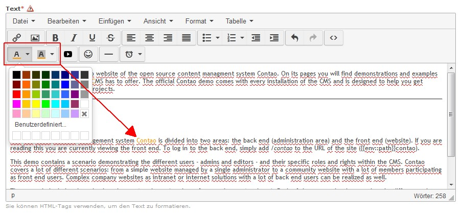

Contao Extension: TinyMceTextColor
==================================

Special TinyMCE plugin that adds the forecolor/backcolor button controls which enables you to pick colors from a color picker and apply these to text.

The sources of this plugin could be found [here](http://www.tinymce.com/wiki.php/Plugin:textcolor).

Installation
------------

Install the extension via composer: [cliffparnitzky/tiny-mce-text-color](https://packagist.org/packages/cliffparnitzky/tiny-mce-text-color).

If you prefer to install it manually, download the latest release here: https://github.com/cliffparnitzky/TinyMceTextColor/releases

Tracker
-------

https://github.com/cliffparnitzky/TinyMceTextColor/issues

Compatibility
-------------

- Contao version >= 4.4.0

Dependency
----------

- To load this plugin and add it to the configuration the extension [[TinyMcePluginLoader]](https://github.com/cliffparnitzky/TinyMcePluginLoader) has to be installed.

Screenshot
----------

Additional information
----------------------

### Special notes

To use custom defined colors, the plugin [[TinyMceColorpicker]](https://github.com/cliffparnitzky/TinyMceColorpicker) must also be installed.

### Information in the wiki

#### Create a new ...

* [Creating a new plugin](https://github.com/cliffparnitzky/TinyMcePluginLoader/wiki/Creating-a-new-plugin)
* [Creating a new bundle](https://github.com/cliffparnitzky/TinyMcePluginLoader/wiki/Creating-a-new-bundle)
* [Creating a new setup](https://github.com/cliffparnitzky/TinyMcePluginLoader/wiki/Creating-a-new-setup)

#### Installation hints
* [Install manually](https://github.com/cliffparnitzky/TinyMcePluginLoader/wiki/Install-manually)

#### Bug report hints

* [Report a bug](https://github.com/cliffparnitzky/TinyMcePluginLoader/wiki/Report-a-bug)